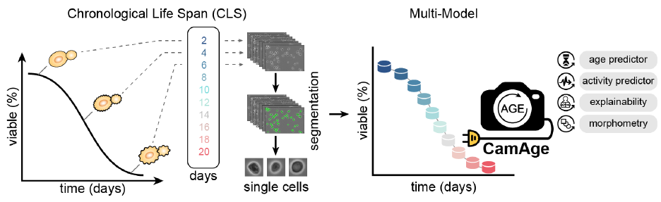

<div align="center"> <h1>CamAge </h1> </div>
 <br>
<div align="center">
</div>

<div align="center"><b>An Image-based Intelligent Lens for single-cell Age Prediction and its Aging-associated Bioactivities</b></div><br><br>
An advanced transfer learning framework utilizing spatiotemporal information from phase-contrast images to predict yeast cell age at single-cell resolution. In addition, CamAge integrates predictive models for various aging-related biological processes, such as genomic instability, reactive oxygen species, mitochondrial content, and potential, among others, and also calculates cellular morphometric parameters.


<div align="center"> <h1>CamAge Docker Container </h1> </div>
<br>

This is the repo of the official [Docker image]() for **CamAge**.


You can find instructions for installing and running Docker on any PC using the following [links](https://docs.docker.com/engine/install/) 
1. [Windows](https://docs.docker.com/desktop/install/windows-install/)
2. [MacOS](https://docs.docker.com/desktop/install/mac-install/)
3. [Linux](https://docs.docker.com/desktop/install/linux-install/)

<h2>Pulling the CamAge Image</h2>

Pull the **CamAge** image from Docker Hub by running the following command in your terminal:

```
$ docker pull 
```
<h2>Verifying the Image</h2><br>

Verify the new image has been created using the **docker images** command.
```
$ docker images
```
<h2>Accessing the Docker Image Terminal</h2><br>

To access the terminal of a Docker image, you can use the **docker run** command with the **-it** option.
```
$ docker run -it <image-name> bash
```
<h2>Managing Containers</h2><br>

Replace **<image-name\>** with the name or ID of the Docker image of **CamAge**.

Find the ID of the currently running container for **input** and **output**.
```
$ docker ps -a
```
To start the container again, access its terminal. 
```
$ docker start <container-ID>
$ docker exec -it <container-ID> bash
```

## Input/Output

### Input 
Find the ID of the currently running container, which was just executed using the **docker ps -a** command.
```
$ docker ps -a
```
To write a file to the container, use the **docker cp** command to copy the file from the host to the container.
```
$ docker cp file container_id:WDir/
```
This command will copy the **folder** from the host's current directory to the **CamAge** container with ID **container_id** at the WDir/ directory inside the container.

### Output
Find the ID of the currently running container, which was just executed using the **docker ps -a** command.
```
$ docker ps -a
```
To write a file from the container, use the **docker cp** command to copy the file from the container to the host.
```
$ docker cp container_id:WDir/file-name .
```
This command will copy the **folder** from the **CamAge** container with ID **container_id** under the WDir/ directory inside the container to the host's current directory.

## Running **CamAge**
There are two CamAge Docker images available: one optimized for GPU usage and the other for CPU. Users can select the appropriate image based on their specific requirements.

## 1. segmenter
This command segments yeast cell images.
```
$ segmenter -id raw_input_folder -od segmenter_output_folder
```
<b>Additional arguments:</b>

| Arguments | Description |
| -------- | -------- |
| id | Input the folder path containing the raw images of yeast cells. |
| od | Output folder path for the segmented images |

<b>Returns:<br></b>

~ masks: segmented file for the raw images <br>
~ preprocessed_images: preprocessed images <br>
~ compressed_masks.csv: compressed masked .csv for images <br>


## 2. Predictor
This command processes raw yeast images, converting them into single-cell yeast images and providing CamAge predictions.

<b>Basic Usage</b>
```
$ predictor -id raw_input_folder -od prediction_output -segmented segmenter_output_folder -SCImages sc_output_folder
```
<b> Advanced Usage</b>
```
$ predictor -id raw_input_folder -od prediction_output -segmented segmenter_output_folder -SCImages sc_output_folder explainability -image_features -num_features 3 -bio_prediction
```
<b>Additional arguments:</b>

| Arguments | Description |
| -------- | -------- |
| id | Input the folder path containing the raw images of yeast cells|
| od | Output folder path for the CamAge predictions|
| segmented | Output folder path for the segmented images|
| SCImages | Output folder path for single-cell yeast images|
| explainability | Generate explainability plots for the predictions|
| num_features | Number of top features to include for explainability|
| image_features | Include image features for bioactivity predictions|
| bio_prediction | Generate bioactivity predictions|

<b>Returns:<br></b>

~ Single yeast cell images<br>
~ Morphometric features<br>
~ A .csv file of CamAge predictions<br>
~ Explainability plots for predictions of each image<br>


